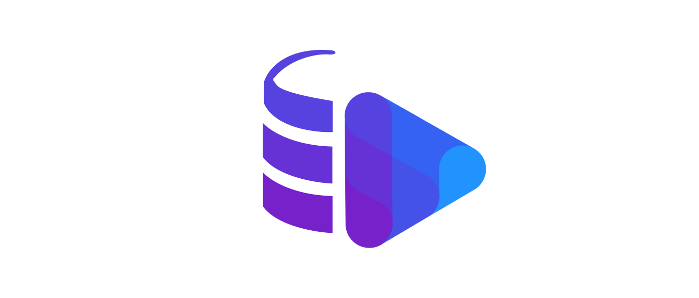

[![Stargazers][stars-shield]][stars-url]
[![Issues][issues-shield]][issues-url]
[![MIT License][license-shield]][license-url]

# 10Play - Dexie Logger



## About the project

This project created while working with dexie, from the need to better debugging tool

## Getting Started

### Installation

To install the package use:

```bash
    yarn add dexie-logger
```

OR

```bash
    npm install dexie-logger
```

### Usage

To add the logger to your DB, simply apply it as a middleware

```typescript
// Import the logger
import logger from "dexie-logger";

// Apply the logger
db.use(logger());
```

## More options

when creating the logger you can git it some params

- either `tableWhiteList` or `tablesBlackList`, Those receive a list with table names to white list / black list

- either `operationsWhiteList` or `operationsBlackList`, same as for tables but receives dexie operations names: `mutate, get, getMany, query, openCursor, count`

### Advanced example

```typescript
// Import the logger
import logger from "dexie-logger";

// Apply the logger
db.use(
  logger({
    tableWhiteList: ["events", "users"],
    operationsWhiteList: ["mutate", "query"],
  })
);
```

## Contributing

Contributions are what make the open source community such an amazing place to learn, inspire, and create. Any contributions you make are **greatly appreciated**.

If you have a suggestion that would make this better, please fork the repo and create a pull request. You can also simply open an issue with the tag "enhancement".
Don't forget to give the project a star! Thanks again!

1. Fork the Project
2. Create your Feature Branch (`git checkout -b feature/AmazingFeature`)
3. Commit your Changes (`git commit -m 'Add some AmazingFeature'`)
4. Push to the Branch (`git push origin feature/AmazingFeature`)
5. Open a Pull Request

You can test and validate your changes with the [Demo](./demo/README.md)

## License

Distributed under the MIT License. See `LICENSE.txt` for more information.

[stars-shield]: https://img.shields.io/github/stars/10play/dexie-logger.svg?style=for-the-badge
[stars-url]: https://github.com/10play/dexie-logger/stargazers
[issues-shield]: https://img.shields.io/github/issues/10play/dexie-logger.svg?style=for-the-badge
[issues-url]: https://github.com/10play/dexie-logger/issues
[license-shield]: https://img.shields.io/github/license/10play/dexie-logger.svg?style=for-the-badge
[license-url]: https://github.com/10play/dexie-logger/blob/master/LICENSE.txt
